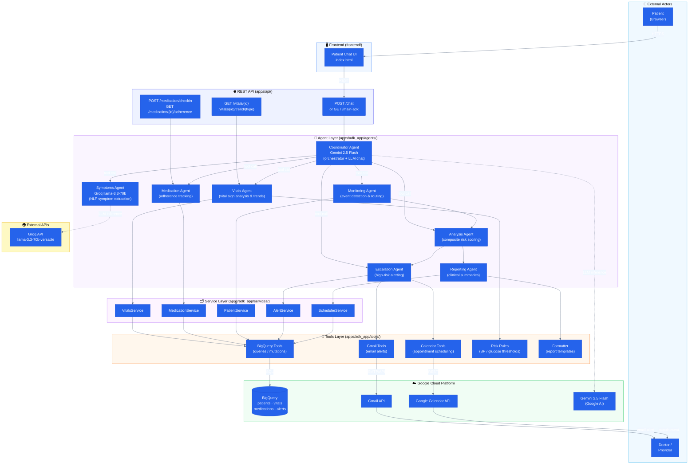
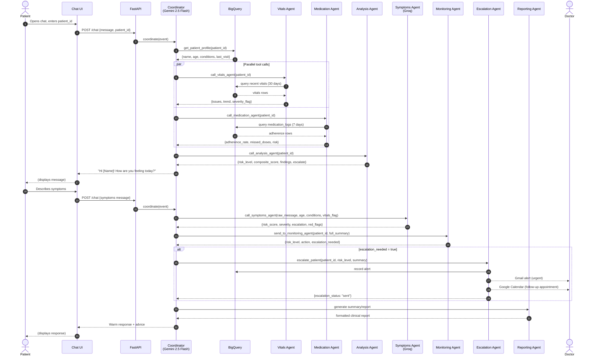
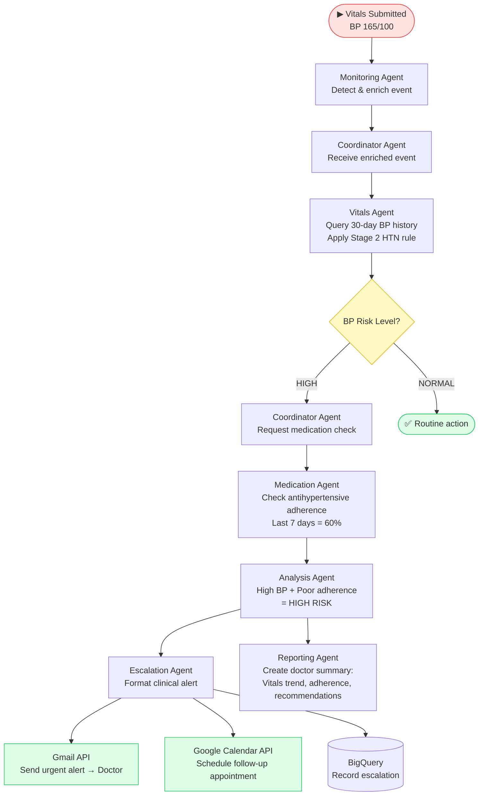
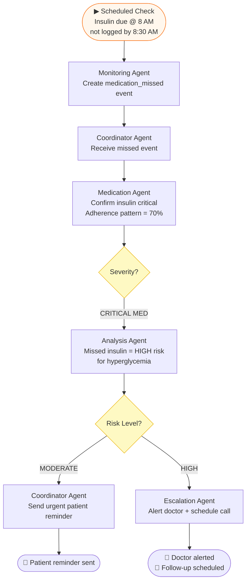
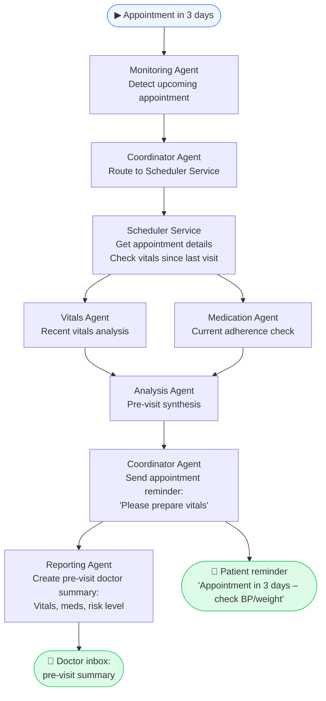
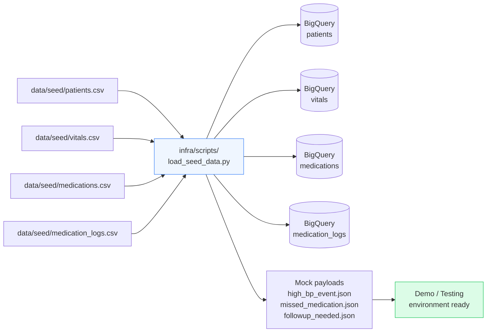
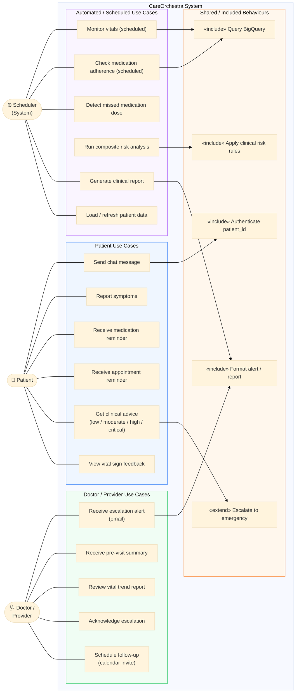
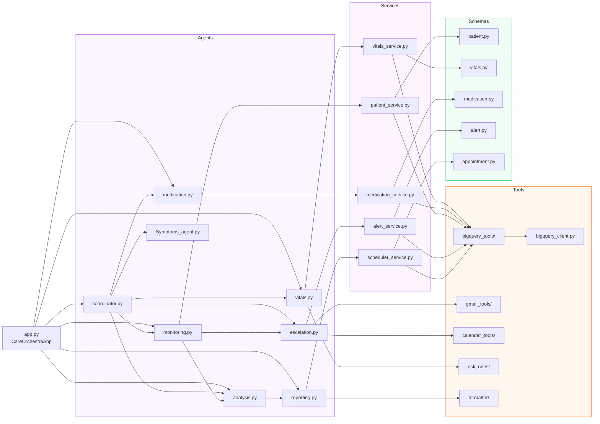
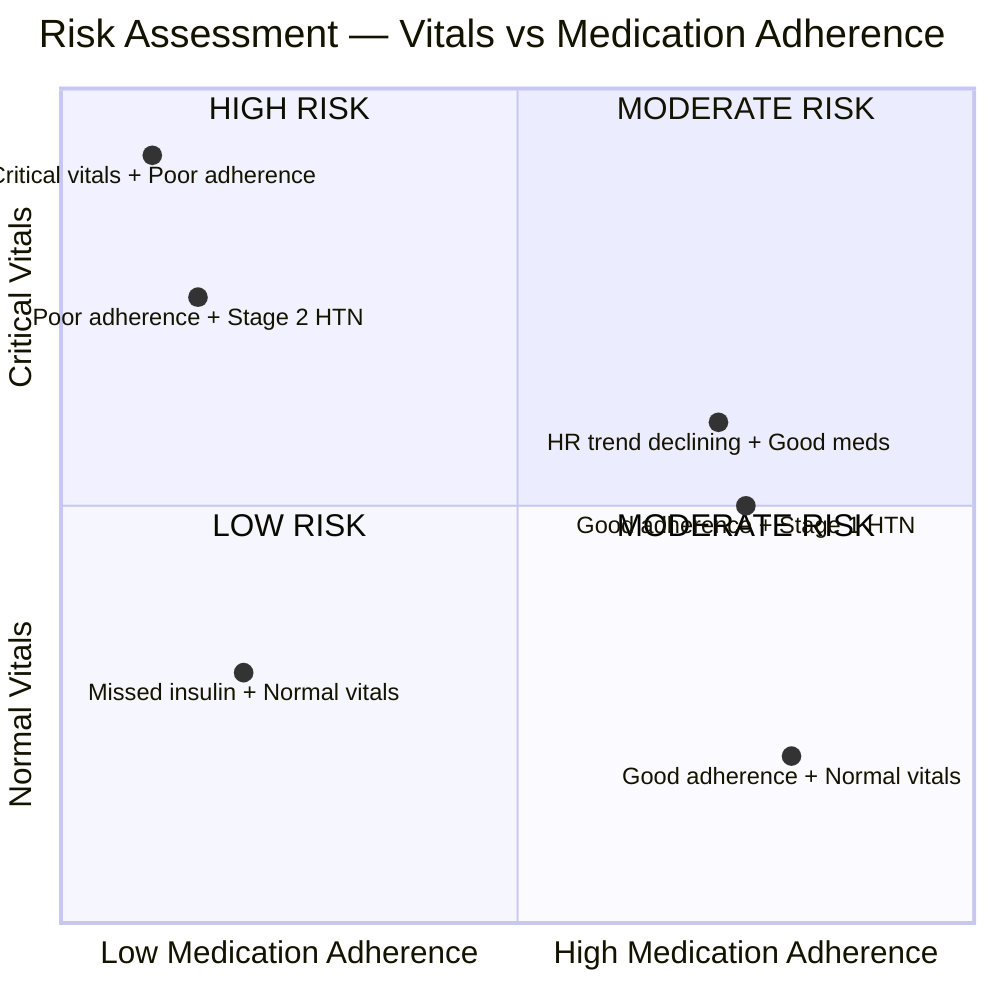

# CareOrchestra — Diagrams

> All diagrams are written in [Mermaid](https://mermaid.js.org/) and render
> natively on GitHub.  Open any `.md` file on GitHub to see the rendered
> charts.

---

## 1 · System Architecture

The diagram below shows every layer of the system and how they are wired together.

### Key Architecture Decisions

| Aspect | Detail |
|--------|--------|
| **Orchestration model** | Single Coordinator Agent (Gemini 2.5 Flash) drives conversation; worker agents are called as async tools |
| **Dual LLM strategy** | Gemini for orchestration reasoning; Groq llama-3.3-70b for fast NLP symptom extraction |
| **Data persistence** | All structured data lives in BigQuery; no local stateful DB |
| **Alert delivery** | Gmail API for doctor alerts; Google Calendar API for scheduling follow-ups |
| **Deployment target** | Google Cloud Run (containerised with Docker) |
| **API surface** | FastAPI with CORS; two main endpoints (`/chat`, `/main-adk`) plus direct agent endpoints |

---

## 2 · Workflow Diagrams

### 2a · Primary Patient Chat Workflow

Covers the happy path: patient opens chat → Coordinator gathers context → collects symptoms → routes to Monitoring → escalates if needed.

---

### 2b · High Blood Pressure Alert Workflow

---

### 2c · Missed Medication Workflow

---

### 2d · Appointment Pre-Visit Workflow

---

### 2e · Data Ingestion (Seed Data) Workflow

---

## 3 · Use Case Diagram

### Actor Summary

| Actor | Role | Primary Interactions |
|-------|------|---------------------|
| **Patient** | Chronic-care patient with one or more conditions (hypertension, diabetes, heart disease) | Opens chat, reports symptoms, receives advice and reminders |
| **Doctor / Provider** | Primary care physician or specialist | Receives email escalation alerts, pre-visit summaries, and calendar invitations |
| **Scheduler (System)** | Automated cron / event trigger | Drives periodic vitals checks, medication adherence scans, appointment reminders, and seed data loading |

---

## 4 · Component Dependency Map

Shows which files depend on which — useful for understanding impact of changes.

---

## 5 · Risk Level Decision Matrix

---

*Generated from live codebase. Update this file whenever new agents, services, or integrations are added.*
